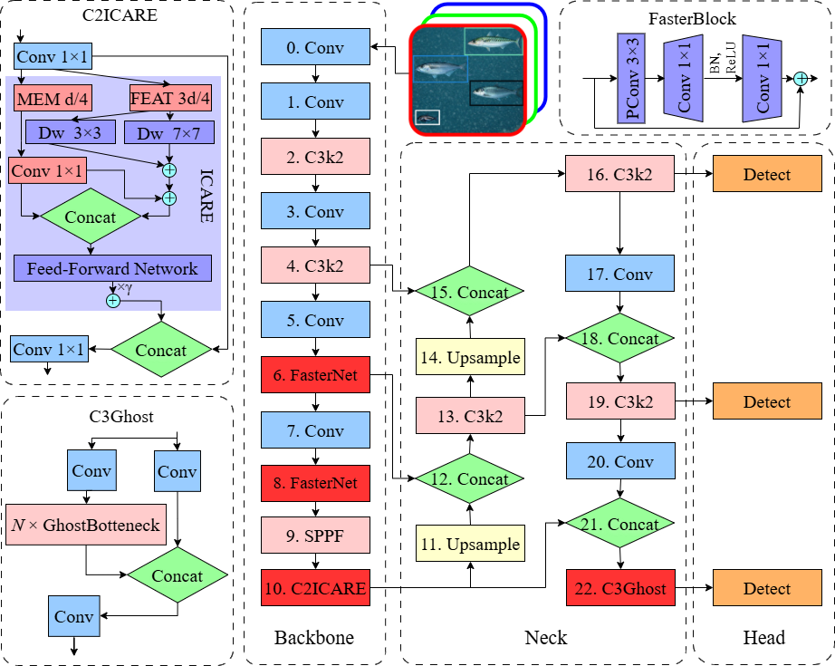
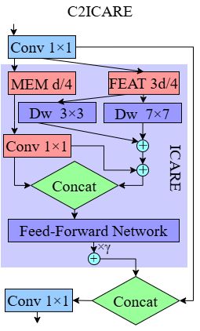
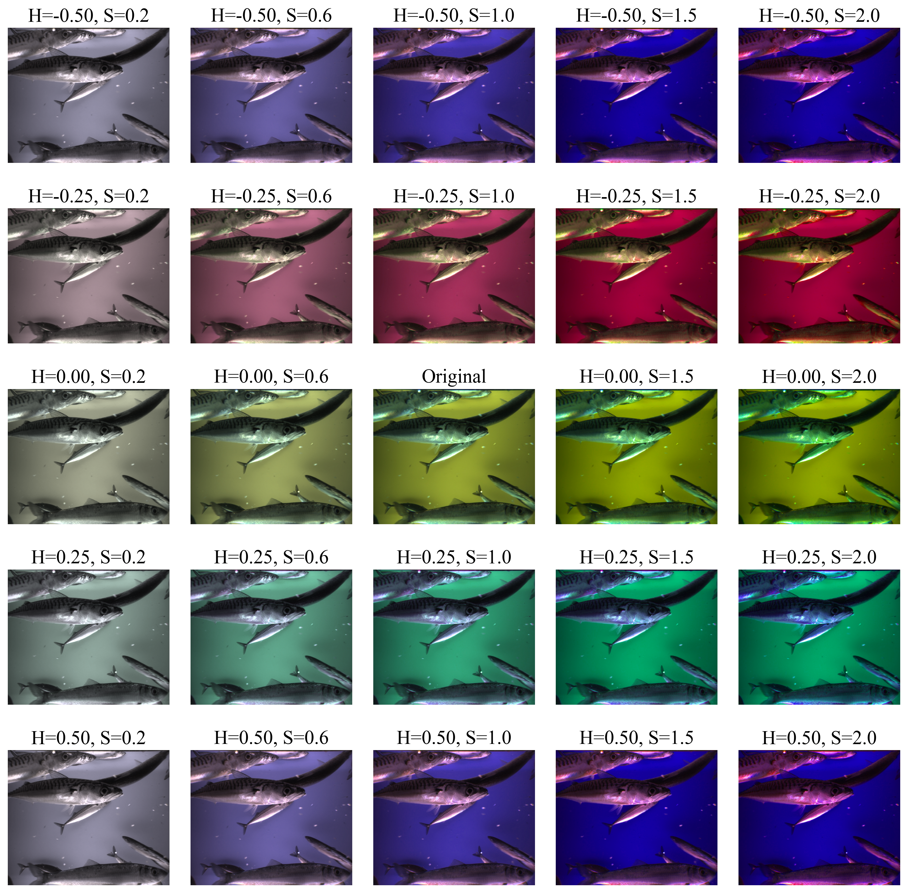
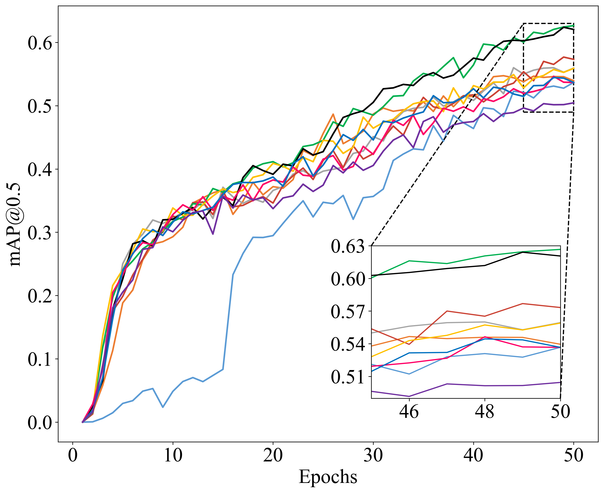
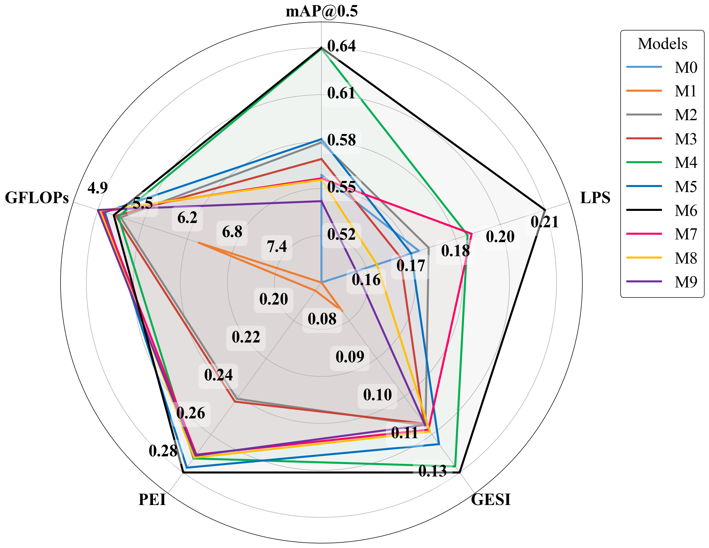
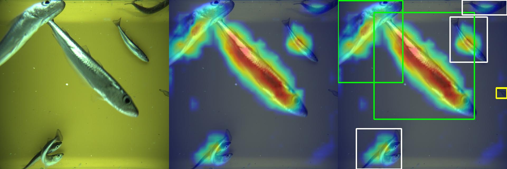
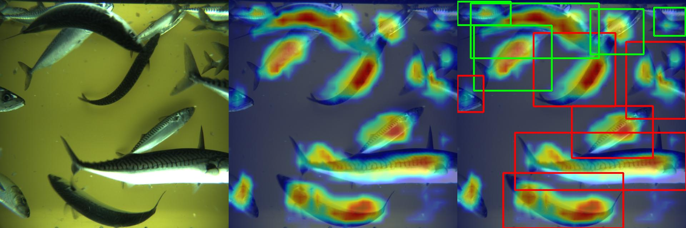
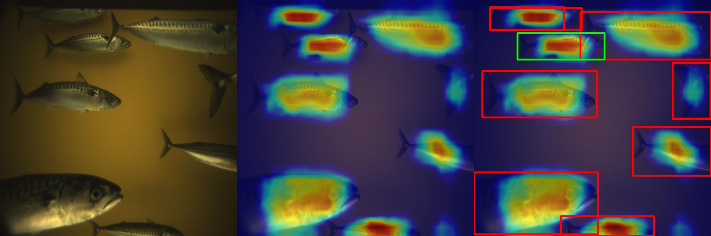
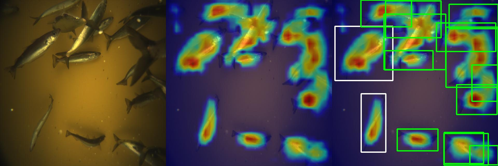

# C2ICARE‑Optimized YOLO for Real‑Time Marine Species Detection via Multi‑Scale Convolutional Design

[](https://www.gnu.org/licenses/agpl-3.0)
[](https://www.python.org/downloads/)
[](https://github.com/ultralytics/ultralytics)

**Official implementation of C2ICARE (Convolution to Interactive Capture and Re‑calibration Enhancement), a multi‑scale convolutional module that optimizes YOLO for real‑time marine species detection. It surpasses the YOLO26n baseline in accuracy by 12% while reducing GFLOPs by 1.9%.**

---

## 📢 Updates

- `April 2026`: 🚀 Initial release of code and pretrained weights
- `April 2026`: 📄 Paper available

---

## 🏗️ Architecture

This section describes the architectural design of the proposed model. Figure 1 presents the complete YOLO26n-based architecture with the integrated modules (FasterBlock, C2ICARE, and C3Ghost), while Figure 2 details the internal structure of the C2ICARE module.

### Complete Model Architecture

**Figure 1** shows the detailed architecture of the proposed YOLO26n-based model, integrating FasterBlock, C2ICARE, and C3Ghost modules for optimized fish detection in underwater cameras.

<p align="center">
  
  <br>
  <em>Figure 1. Detailed architecture of the proposed YOLO26n-based model, integrating FasterBlock, C2ICARE, and C3Ghost modules.</em>
</p>

### C2ICARE Module

The C2ICARE module is the core contribution of this work. It employs a partitioned memory‑feature split, multi‑scale depthwise convolutions (3×3 and 7×7), and a simplified cross‑branch projection to enhance multi‑scale feature extraction while maintaining low computational overhead.

<p align="center">
  
  <br>
  <em>Figure 2. Internal architecture of the proposed C2ICARE module.</em>
</p>

---

## 📊 Experimental Results

This section presents the quantitative and qualitative results of our experiments. We evaluate data augmentation strategies, training performance, detection metrics, multi‑objective optimization, and explainability analysis.

### Data Augmentation

To simulate the variability of underwater lighting conditions (which depend primarily on artificial illumination rather than ambient light), HSV shifts were applied with a hue shift range of ±0.5 and a saturation multiplier ranging from 0 to 2.

<p align="center">
  
  <br>
  <em>Figure 3. HSV augmentation grid for hue shift versus saturation factor. The centre cell (hue=0, saturation=1) corresponds to the original image.</em>
</p>

### Training Performance

The training was limited to 50 epochs (full convergence was not pursued). All reported values are averaged across three independent runs with random seeds 0, 1, and 2. Figure 4 shows the mAP@0.5 progression over epochs for all model variants (M0–M9).

<p align="center">
  
  <br>
  <em>Figure 4. Mean Average Precision (mAP@0.5) performance progress over 50 epochs, averaged across three independent runs (random seeds 0, 1, and 2). M0: YOLOv8n; M1: YOLO11n; M2: YOLO26n; M3: +FasterBlock; M4: +C2ICARE; M5: +C3Ghost; M6: +FasterBlock+C2ICARE; M7: +C2ICARE+C3Ghost; M8: +FasterBlock+C3Ghost; M9: all three modules.</em>
</p>

### Performance Metrics

Table 2 summarizes the performance metrics and computational complexity for all model configurations evaluated on the test split. Metrics include mAP@0.5, mAP@0.5:0.95, precision, recall, number of parameters, and GFLOPs.

| Model | FasterBlock | C2ICARE | C3Ghost | mAP@0.5 | mAP@0.5:0.95 | Precision | Recall | Parameters | GFLOPs |
|-------|-------------|---------|---------|---------|--------------|-----------|--------|------------|--------|
| M0 | | | | 0.5571 | 0.3071 | 0.5374 | 0.5853 | 3,006,428 | 8.088 |
| M1 | | | | 0.4892 | 0.2474 | 0.4795 | 0.5263 | 2,582,932 | 6.316 |
| M2 | | | | 0.5777 | 0.3325 | 0.5740 | 0.5475 | 2,375,616 | 5.193 |
| M3 | ✓ | | | 0.5672 | 0.3214 | 0.5617 | 0.5442 | 2,319,296 | 5.125 |
| M4 | | ✓ | | 0.6369 | 0.3715 | 0.6217 | 0.6034 | 2,334,112 | 5.160 |
| M5 | | | ✓ | 0.5798 | 0.3376 | 0.5658 | 0.5477 | 2,089,248 | 4.964 |
| M6 | ✓ | ✓ | | 0.6375 | 0.3800 | 0.6248 | 0.6029 | 2,277,792 | 5.093 |
| M7 | | ✓ | ✓ | 0.5550 | 0.3125 | 0.5356 | 0.5274 | 2,047,744 | 4.931 |
| M8 | ✓ | | ✓ | 0.5541 | 0.3137 | 0.5268 | 0.5740 | 2,032,928 | 4.897 |
| M9 | ✓ | ✓ | ✓ | 0.5406 | 0.3079 | 0.5230 | 0.5458 | 1,991,424 | 4.864 |

*M0 represents the YOLOv8n baseline; M1 denotes the YOLO11n baseline; M2 is the YOLO26n baseline. M3 to M9 are the proposed YOLO26n architectural variants.*

### Multi‑Objective Performance

To determine the viability of the proposed models for real‑time deployment, a multi‑objective analysis was performed. Figure 6 presents a radial performance comparison of all YOLO architectures (M0–M9), integrating mAP@0.5, LPS, GESI, PEI, and GFLOPs. The GFLOPs axis is inverted such that peripheral placement reflects lower computational demand and enhanced efficiency.

<p align="center">
  
  <br>
  <em>Figure 6. Radial performance comparison of YOLO architectures (M0–M9). The GFLOPs axis is inverted such that peripheral placement reflects lower computational demand and enhanced efficiency.</em>
</p>

### XAI Analysis: EigenCAM Visualisation

To validate that the M6 model's predictions are based on fish morphology rather than spurious background cues, an EigenCAM analysis was performed on test images from both the 2017 and 2018 cruises. Figure 7 shows EigenCAM visualisations for the proposed M6 model on four test images. The colour coding for bounding boxes is as follows: mackerel (red), herring (green), bluewhiting (white), mesopelagic (yellow).

<p align="center">
  
  <br>
  <em>Figure 7a. EigenCAM visualisation for ST1_135-20180503160446316: 3 bluewhiting, 2 herring, 1 mesopelagic.</em>
</p>

<p align="center">
  
  <br>
  <em>Figure 7b. EigenCAM visualisation for ST6_6-20180506204859914: 6 mackerel, 5 herring.</em>
</p>

<p align="center">
  
  <br>
  <em>Figure 7c. EigenCAM visualisation for ST019-13-20170511204755726: 8 mackerel.</em>
</p>

<p align="center">
  
  <br>
  <em>Figure 7d. EigenCAM visualisation for ST033-864-607-20170520203304451: 2 bluewhiting, 12 herring.</em>
</p>

---

## 🚀 Quick Start

This section provides instructions to set up, train, validate, and run inference with the proposed model.

### Prerequisites

- Python 3.8+
- CUDA 11.8 (for GPU training)
- PyTorch 1.10+
- Ultralytics YOLOv8.0.117+

### Installation

Clone the repository and install the required dependencies:

```bash
git clone https://github.com/VinieLee/C2ICARE-Optimized-YOLO-for-Real-Time-Marine-Species-Detection-via-Multi-Scale-Convolutional-Design.git
cd C2ICARE-Optimized-YOLO-for-Real-Time-Marine-Species-Detection-via-Multi-Scale-Convolutional-Design
pip install -r requirements.txt
```

### Dataset Preparation
```
📁 your_dataset/
├── 📁 images/
│   ├── 📁 train/
│   ├── 📁 val/
│   └── 📁 test/
├── 📁 labels/
│   ├── 📁 train/
│   ├── 📁 val/
│   └── 📁 test/
└── 📄 data.yaml
```
### 📄 License

This project is licensed under the GNU Affero General Public License v3.0 - see the LICENSE file for details.
This license requires that if you modify the code and provide a service over a network (e.g., a web API), you must make the complete source code available to users under the same license.

### 📚 Citation
```bash
@article{SilvaAlvarado2026C2ICARE,
  title={C2ICARE‑Optimized YOLO for Real‑Time Marine Species Detection via Multi‑Scale Convolutional Design},
  author={Silva-Alvarado, Vinie Lee and Ahmad, Ali and Sendra, Sandra and Lloret, Jaime},
  journal={[Journal Name]},
  year={2026},
  note={Under review}
}

@dataset{AllkenRosen2020DeepVisionFishDataset,
  author={Allken, Vaneeda and Rosen, Shale},
  title={Deep Vision Fish Dataset},
  year={2020},
  doi={10.21335/NMDC-551736490},
  url={https://doi.org/10.21335/NMDC-551736490}
}

@article{10.1093/icesjms/fsab227,
    author = {Allken, Vaneeda and Rosen, Shale and Handegard, Nils Olav and Malde, Ketil},
    title = {A deep learning-based method to identify and count pelagic and mesopelagic fishes from trawl camera images},
    journal = {ICES Journal of Marine Science},
    volume = {78},
    number = {10},
    pages = {3780-3792},
    year = {2021},
    month = {12},
    abstract = {Fish counts and species information can be obtained from images taken within trawls, which enables trawl surveys to operate without extracting fish from their habitat, yields distribution data at fine scale for better interpretation of acoustic results, and can detect fish that are not retained in the catch due to mesh selection. To automate the process of image-based fish detection and identification, we trained a deep learning algorithm (RetinaNet) on images collected from the trawl-mounted Deep Vision camera system. In this study, we focused on the detection of blue whiting, Atlantic herring, Atlantic mackerel, and mesopelagic fishes from images collected in the Norwegian sea. To address the need for large amounts of annotated data to train these models, we used a combination of real and synthetic images, and obtained a mean average precision of 0.845 on a test set of 918 images. Regression models were used to compare predicted fish counts, which were derived from RetinaNet classification of fish in the individual image frames, with catch data collected at 20 trawl stations. We have automatically detected and counted fish from individual images, related these counts to the trawl catches, and discussed how to use this in regular trawl surveys.},
    issn = {1054-3139},
    doi = {10.1093/icesjms/fsab227},
    url = {https://doi.org/10.1093/icesjms/fsab227},
    eprint = {https://academic.oup.com/icesjms/article-pdf/78/10/3780/41772702/fsab227.pdf},
}

METADATA
@article{https://doi.org/10.1002/gdj3.114,
author = {Allken, Vaneeda and Rosen, Shale and Handegard, Nils Olav and Malde, Ketil},
title = {A real-world dataset and data simulation algorithm for automated fish species identification},
journal = {Geoscience Data Journal},
volume = {8},
number = {2},
pages = {199-209},
keywords = {data augmentation, fish dataset, machine learning, synthetic data},
doi = {https://doi.org/10.1002/gdj3.114},
url = {https://rmets.onlinelibrary.wiley.com/doi/abs/10.1002/gdj3.114},
eprint = {https://rmets.onlinelibrary.wiley.com/doi/pdf/10.1002/gdj3.114},
abstract = {Abstract Developing high-performing machine learning algorithms requires large amounts of annotated data. Manual annotation of data is labour-intensive, and the cost and effort needed are an important obstacle to the development and deployment of automated analysis. In a previous work, we have shown that deep learning classifiers can successfully be trained on synthetic images and annotations. Here, we provide a curated set of fish image data and backgrounds, the necessary software tools to generate synthetic images and annotations, and annotated real datasets to test classifier performance. The dataset is constructed from images collected using the Deep Vision system during two surveys from 2017 and 2018 that targeted economically important pelagic species in the Northeast Atlantic Ocean. We annotated a total of 1,879 images, randomly selected across trawl stations from both surveys, comprising 482 images of blue whiting, 456 images of Atlantic herring, 341 images of Atlantic mackerel, 335 images of mesopelagic fishes and 265 images containing a mixture of the four categories.},
year = {2021}
}


```


