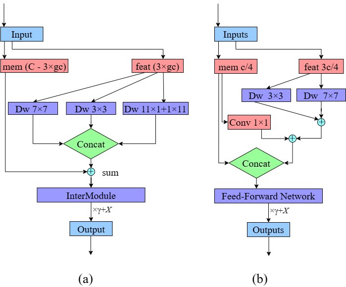

# C2ICARE: Convolution to Interactive Capture and Re‑calibration Enhancement for Real‑Time Object Detection

[](https://www.gnu.org/licenses/agpl-3.0)
[](https://www.python.org/downloads/)
[](https://github.com/ultralytics/ultralytics)
[](https://pytorch.org/)

**Official implementation of C2ICARE (Convolution to Interactive Capture and Re‑calibration Enhancement), a lightweight multi‑scale attention module that preserves spatial information through a memory‑feature split while capturing multi‑scale patterns via depthwise convolutions (3×3 and 7×7). Integrated into YOLO26n, C2ICARE achieves mAP@0.5:0.95 of 0.7033 ± 0.0207, outperforming CoordAtt (+3.8%), CBAM (+0.4%), FasterBlock (+1.7%), and ImCA (+0.6%) on an underwater fish dataset.**

---

## 📢 Updates

- `April 2026`: 🚀 Initial release of code and pretrained weights
- `April 2026`: 📄 Paper submitted to *Mathematical Methods in the Applied Sciences*

---

## 🏗️ Architecture

This section describes the architectural design of the proposed C2ICARE module and its integration into YOLO26n.

### C2ICARE Block Architecture

The proposed C2ICARE module is inserted at layer 10 of the YOLO26n backbone, replacing the standard C2PSA layer. This insertion point was selected because it occurs at a stage where feature maps have reached sufficient abstraction to benefit from multi‑scale processing while still maintaining a resolution that allows precise spatial localization. The detection head (layer 23) remains trainable from the beginning.

**Figure 1** shows the architectural comparison between the CARE Block and the proposed C2ICARE Block.

<p align="center">
  
  <br>
  <em>Figure 1. Architectural comparison between (a) the CARE Block and (b) the proposed C2ICARE Block. The C2ICARE Block replaces the complex three‑branch parallel processing of CARE with a simplified memory‑feature split, multi‑scale depthwise convolutions (3×3 and 7×7), a single cross‑branch projection, and a lightweight ConvNeXt FFN.</em>
</p>

The C2ICARE module employs a partitioned memory‑feature split (1:3 ratio), multi‑scale depthwise convolutions (3×3 for fine‑grained local structures and 7×7 for broader semantic regions), cross‑branch interaction via 1×1 convolution, concatenation, ConvNeXt-style feed‑forward network (FFN), and residual connection with learnable layer scaling.


### C2ICARE Wrapper Module

To facilitate seamless integration into existing YOLO-based detection architectures, a wrapper module encapsulates the C2ICARE block within a residual-style structure, serving as a drop‑in replacement for standard convolutional blocks such as the C3k2 module.

<p align="center">
  
  <br>
  <em>Figure 2. Internal architecture of the proposed C2ICARE block. The processing pipeline is organized into memory‑feature split, multi‑scale depthwise convolution, cross‑branch interaction, concatenation, FFN recalibration, and residual connection with layer scaling.</em>
</p>

---

## 📊 Experimental Results

This section presents the quantitative results of our experiments, including training dynamics, detection metrics, multi‑objective optimisation, threshold optimisation for reliable detection, and XAI visualisation.

### Training Performance

All models were trained for 50 epochs with a batch size of 64 and an input resolution of 640×640 pixels, using deterministic settings with random seeds 0, 1, and 2 for reproducibility. A three‑phase progressive freezing strategy was employed to ensure fair comparison. All reported values are expressed as mean ± expanded uncertainty (k=2), providing a 95% confidence interval following the Guide to the Expression of Uncertainty in Measurement (GUM).


**Table 1** summarises the performance metrics and computational complexity for all evaluated attention modules on the YOLO26n baseline. Values are reported as mean ± expanded uncertainty (k=2).

| Model | mAP@0.5:0.95 (95% CI) | Parameters | GFLOPs |
|-------|----------------------|------------|--------|
| YOLO26n + CoordAtt | 0.6774 ± 0.0203 | 2,140,144 | 5.009 |
| YOLO26n + FasterBlock | 0.6912 ± 0.0218 | 2,427,328 | 5.236 |
| YOLO26n + ImCA | 0.6990 ± 0.0194 | 2,139,616 | 5.021 |
| YOLO26n + CBAM | 0.7003 ± 0.0184 | 2,135,860 | 5.008 |
| **YOLO26n + C2ICARE (Ours)** | **0.7033 ± 0.0207** | **2,334,112** | **5.160** |

### Multi‑Objective Evaluation

To select the most suitable architecture for real‑time deployment on underwater camera systems, a multi‑objective evaluation framework was established using LPS, GESI, PEI, and Pareto Frontier analysis. 

**Table 2** presents the multi‑objective ranking and Pareto efficiency results.

| Model | Custom Score | Overfitting | Pareto Frontier |
|-------|--------------|-------------|-----------------|
| YOLO26n + C2ICARE | 0.6189 | -0.1584 | Yes |
| YOLO26n + CBAM | 0.6058 | -0.1698 | Yes |
| YOLO26n + ImCA | 0.5956 | -0.1912 | Yes |
| YOLO26n + CoordAtt | 0.5956 | -0.2088 | Yes |
| YOLO26n + FasterBlock | 0.3211 | -0.1655 | No |

### XAI Analysis: EigenCAM Visualisation

To validate that the **fine‑tuned M6 model** (obtained after transfer learning, mAP@0.5 = 0.9032) makes predictions based on fish morphology rather than spurious background cues, an EigenCAM analysis was performed on test images from both the 2017 and 2018 cruises. Figure 7 shows EigenCAM visualisations for this fine‑tuned M6 model on four test images. The colour coding for bounding boxes is as follows: mackerel (red), herring (green), bluewhiting (white), mesopelagic (yellow).

<p align="center">
  
  <br>
  <em>Figure 7a. EigenCAM visualisation: 3 bluewhiting, 2 herring, 1 mesopelagic.</em>
</p>

<p align="center">
  
  <br>
  <em>Figure 7b. EigenCAM visualisation: 6 mackerel, 5 herring.</em>
</p>

<p align="center">
  
  <br>
  <em>Figure 7c. EigenCAM visualisation: 8 mackerel.</em>
</p>

<p align="center">
  
  <br>
  <em>Figure 7d. EigenCAM visualisation: 2 bluewhiting, 12 herring.</em>
</p>

## 🚀 Quick Start

This section provides instructions to set up and run the proposed model.

### Prerequisites

- Python 3.8+
- CUDA 11.8 (for GPU training)
- PyTorch 1.10+
- Ultralytics YOLOv8.0.117+

### Dataset Preparation
```
📁 your_dataset/
├── 📁 images/
│   ├── 📁 train/
│   ├── 📁 val/
│   └── 📁 test/
├── 📁 labels/
│   ├── 📁 train/
│   ├── 📁 val/
│   └── 📁 test/
└── 📄 data.yaml
```
### 📄 License

This project is licensed under the MIT License - see the LICENSE file for details.

### 📚 Citation

This work acknowledges the foundational contributions of the research community. We thank Zhou et al. for their CARE Transformer [zhou2025care], which inspired our C2ICARE module. We also thank Allken et al. for the Deep Vision Fish Dataset and their deep learning methods for fish identification. If you find this work useful, please cite:

```bash

@inproceedings{zhou2025care,
  title={CARE Transformer: Mobile-Friendly Linear Visual Transformer via Decoupled Dual Interaction},
  author={Zhou, Yuan and Xu, Qingshan and Cui, Jiequan and Zhou, Junbao and Zhang, Jing and Hong, Richang and Zhang, Hanwang},
  booktitle={Proceedings of the Computer Vision and Pattern Recognition Conference},
  pages={20135--20145},
  year={2025}
}

@dataset{AllkenRosen2020DeepVisionFishDataset,
  author={Allken, Vaneeda and Rosen, Shale},
  title={Deep Vision Fish Dataset},
  year={2020},
  doi={10.21335/NMDC-551736490},
  url={https://doi.org/10.21335/NMDC-551736490}
}

@article{10.1093/icesjms/fsab227,
    author = {Allken, Vaneeda and Rosen, Shale and Handegard, Nils Olav and Malde, Ketil},
    title = {A deep learning-based method to identify and count pelagic and mesopelagic fishes from trawl camera images},
    journal = {ICES Journal of Marine Science},
    volume = {78},
    number = {10},
    pages = {3780-3792},
    year = {2021},
    month = {12},
    issn = {1054-3139},
    doi = {10.1093/icesjms/fsab227},
    url = {https://doi.org/10.1093/icesjms/fsab227},
    eprint = {https://academic.oup.com/icesjms/article-pdf/78/10/3780/41772702/fsab227.pdf},
}

@article{https://doi.org/10.1002/gdj3.114,
    author = {Allken, Vaneeda and Rosen, Shale and Handegard, Nils Olav and Malde, Ketil},
    title = {A real-world dataset and data simulation algorithm for automated fish species identification},
    journal = {Geoscience Data Journal},
    volume = {8},
    number = {2},
    pages = {199-209},
    keywords = {data augmentation, fish dataset, machine learning, synthetic data},
    doi = {https://doi.org/10.1002/gdj3.114},
    url = {https://rmets.onlinelibrary.wiley.com/doi/abs/10.1002/gdj3.114},
    eprint = {https://rmets.onlinelibrary.wiley.com/doi/pdf/10.1002/gdj3.114},
    year = {2021}
}


```


